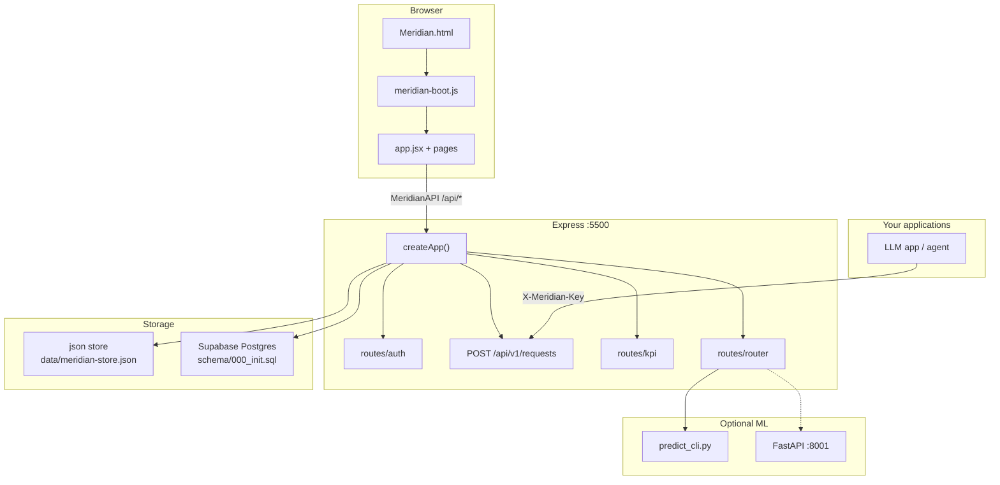
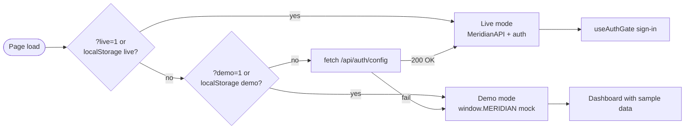
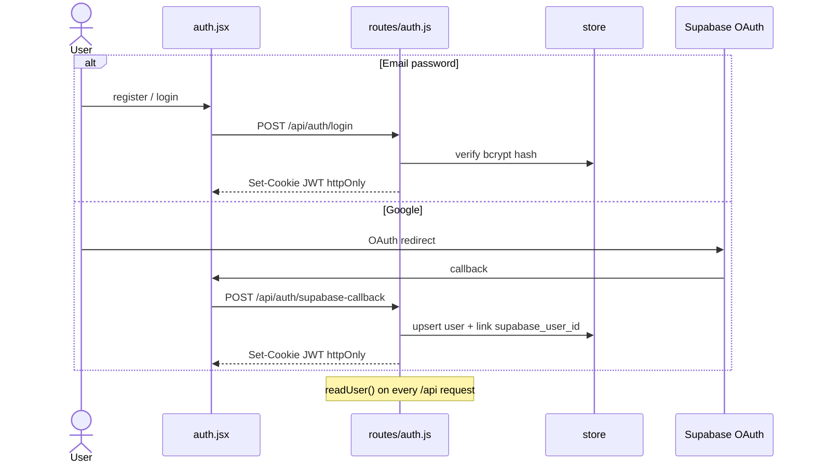
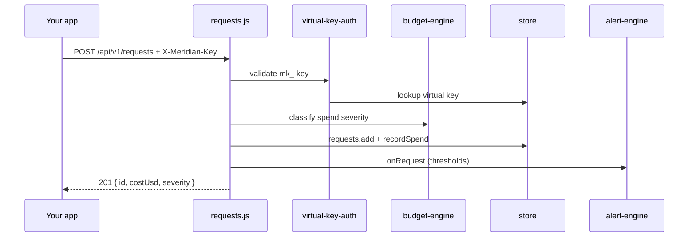
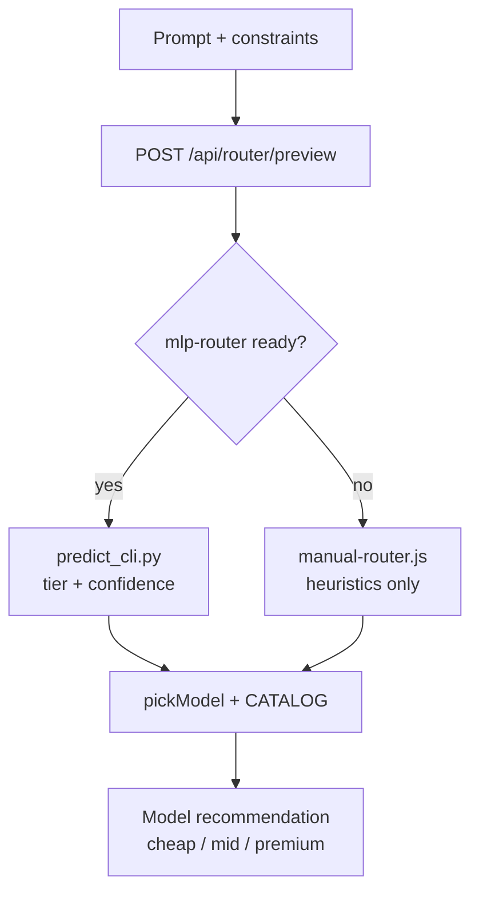
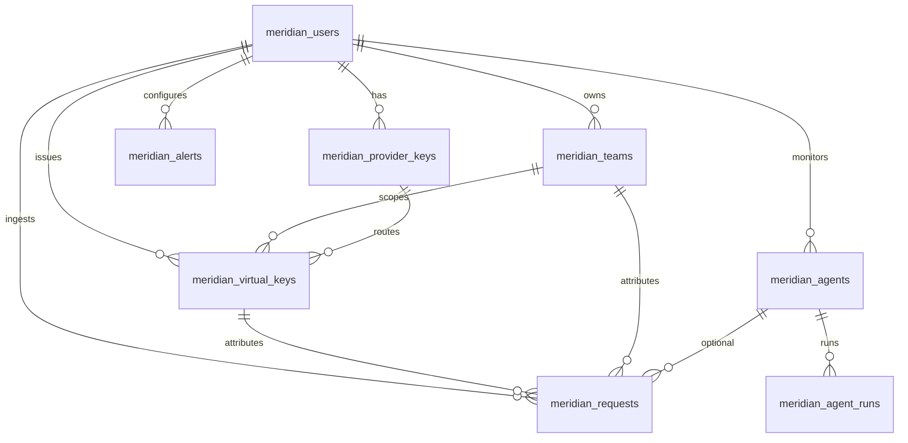
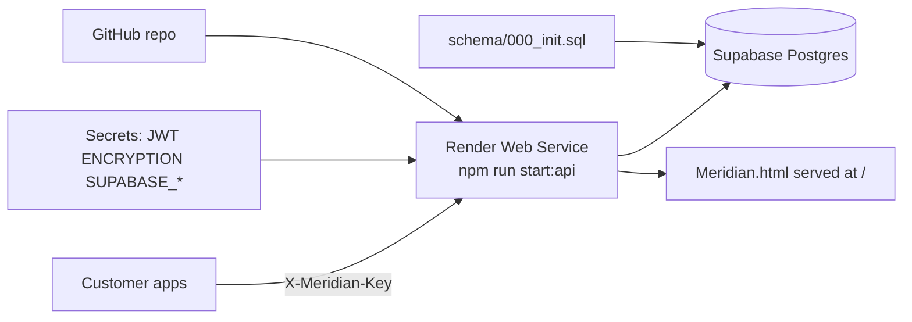

# Meridian AI

**AI cost intelligence for LLM fleets** — see spend by team, cap budgets per key, catch runaway agents, and route prompts to cheaper models when quality holds.

| | |
|---|---|
| **Repository** | [github.com/ShadowEsu/meridian-ai](https://github.com/ShadowEsu/meridian-ai) |
| **Live app** | [meridian20.onrender.com](https://meridian20.onrender.com/) |
| **Author** | [Preston Jay Susanto](https://github.com/ShadowEsu) · prestonjaysusanto@gmail.com |

> **Go live:** **[docs/WEB_PUBLISH.md](docs/WEB_PUBLISH.md)** (Supabase + Google + Render) · **Launch page plan:** **[docs/MERIDIAN_AI_LAUNCH_PLAN.md](docs/MERIDIAN_AI_LAUNCH_PLAN.md)**

---

## What it does

- **Dashboard** — Overview, live feed, request logs, agent monitor, virtual keys, alerts
- **Auth** — Email/password + Google sign-in (via Supabase)
- **Storage** — Supabase Postgres in production, JSON file for local dev
- **Ingest API** — Apps report LLM usage with `X-Meridian-Key` headers
- **ML router** — Python service classifies prompts into `cheap` / `mid` / `premium` tiers (train it yourself)

---

## Architecture & diagrams

Copy this entire section (or the whole README) into docs, Notion, or slides. **Image files** live in [`docs/diagrams/`](docs/diagrams/) — keep that folder next to the README so `` links work. On GitHub, Mermaid blocks below render as interactive diagrams automatically.

### Diagram gallery (SVG images)

| # | Diagram | File |
|---|---------|------|
| 1 | System overview | [`01-system-overview.svg`](docs/diagrams/01-system-overview.svg) |
| 2 | Frontend boot | [`02-frontend-boot.svg`](docs/diagrams/02-frontend-boot.svg) |
| 3 | Demo vs live mode | [`03-demo-vs-live.svg`](docs/diagrams/03-demo-vs-live.svg) |
| 4 | Auth workflow | [`04-auth-workflow.svg`](docs/diagrams/04-auth-workflow.svg) |
| 5 | Request ingest | [`05-request-ingest.svg`](docs/diagrams/05-request-ingest.svg) |
| 6 | ML cost router | [`06-ml-router.svg`](docs/diagrams/06-ml-router.svg) |
| 7 | Database ERD | [`07-database-erd.svg`](docs/diagrams/07-database-erd.svg) |
| 8 | Production deploy | [`08-deploy-workflow.svg`](docs/diagrams/08-deploy-workflow.svg) |
| 9 | Repo map | [`09-repo-structure.svg`](docs/diagrams/09-repo-structure.svg) |

#### 1 — System overview


#### 2 — Frontend boot sequence


#### 3 — Demo vs live mode


#### 4 — Authentication


#### 5 — Request ingest (your apps → dashboard)


#### 6 — ML cost router


#### 7 — Database schema


#### 8 — Production deploy


#### 9 — Repository map


---

### Mermaid diagrams (GitHub / GitLab render these as graphics)

#### End-to-end system flow



#### Demo vs live decision



#### Auth sequence



#### Request ingest sequence



#### ML router decision



#### Database relationships



#### Local development workflows

```mermaid
flowchart TB
  subgraph Demo["UI only (no backend)"]
    D1["npm install"] --> D2["npm start :3000"]
    D2 --> D3["Open localhost:3000\nmock data"]
  end

  subgraph Live["Full stack local"]
    L1["cp .env.example .env"] --> L2["npm run start:api :5500"]
    L2 --> L3["?live=1 or auto-detect"]
    L3 --> L4["npm run seed:demo optional"]
  end

  subgraph ML["Train router optional"]
    M1["cd python/router_service"] --> M2["pip install -r requirements.txt"]
    M2 --> M3["python train_mlp.py"]
    M3 --> M4["artifacts/router.joblib"]
  end

  subgraph CI["Quality"]
    T1["npm test vitest"] --> T2["npm run doctor"]
  end
```



#### Production deploy (Render + Supabase)



---

### Express route map

| Area | Endpoints |
|------|-----------|
| **Auth** | `GET /api/auth/config`, `POST /api/auth/register`, `login`, `supabase-callback`, `logout`, `GET /api/auth/me` |
| **Ingest** | `POST /api/v1/requests` (virtual key), `GET /api/requests` (session) |
| **KPI** | `GET /api/kpi/overview`, `GET /api/kpi/feed` |
| **Keys** | `GET/POST/DELETE /api/provider-keys`, `GET/POST/PUT/DELETE /api/virtual-keys` |
| **Teams** | `GET/POST/PUT/DELETE /api/teams` |
| **Agents** | `GET/POST/PUT/DELETE /api/agents`, runs under `/api/agents/:id/runs` |
| **Alerts** | `GET/POST/PUT/DELETE /api/alerts` |
| **Router** | `POST /api/router/preview`, `GET /api/router/mlp/status`, `GET /api/router/catalog` |
| **Other** | `GET /api/models`, audit log, proxy routes |

---

## Quick start (local demo)

No backend — sample data only:

```bash
npm install
npm start
```

- Dashboard (demo): `http://localhost:3000/`
- Marketing preview: `http://localhost:3000/home`

Sample data from `src/core/data.jsx` — no login, no persistence.

---

## Quick start (live backend)

```bash
cp .env.example .env
# Fill JWT_SECRET, ENCRYPTION_KEY, and Supabase vars (see below)

npm install
npm run start:api
```

Open **`http://localhost:5500/`** (production mirror: **`https://meridian20.onrender.com/`**)

Optional demo data:

```bash
npm run seed:demo
# Login: demo@meridian.local / demo123demo
```

---

## Deploy to Render (production)

This repo includes a [`render.yaml`](render.yaml) blueprint.

### 1. Clone this repo

```bash
git clone https://github.com/ShadowEsu/meridian-ai.git
cd meridian-ai
```

Connect **`ShadowEsu/meridian-ai`** (branch `main`) in [Render](https://dashboard.render.com/).

### 2. Supabase setup

1. Create a [Supabase](https://supabase.com) project
2. Run [`schema/000_init.sql`](schema/000_init.sql) in the SQL editor
3. Enable **Google** under Authentication → Providers
4. Set **Site URL** and **Redirect URLs** to your Render URL (see [docs/WEB_PUBLISH.md](docs/WEB_PUBLISH.md))

### 3. Render environment variables

In Render → **Environment**, set:

| Variable | Value |
|----------|-------|
| `NODE_ENV` | `production` |
| `MERIDIAN_STORE` | `supabase` |
| `JWT_SECRET` | 64-char hex (`node -e "console.log(require('crypto').randomBytes(32).toString('hex'))"`) |
| `ENCRYPTION_KEY` | another 64-char hex |
| `SUPABASE_URL` | `https://YOUR_PROJECT.supabase.co` |
| `SUPABASE_ANON_KEY` | Supabase → Settings → API → **publishable** key (`sb_publishable_…`) |
| `SUPABASE_SERVICE_ROLE_KEY` | same page → **secret** key (`sb_secret_…`, server only) |
| `SUPABASE_JWT_SECRET` | optional — only for legacy HS256; ECC (P-256) projects can omit |

`PORT` is set automatically by Render.

### 4. Deploy

- **New → Blueprint** → connect this repo → branch `main`
- Or **Web Service**: build `npm install`, start `npm run start:api`
- Health check: `/api/auth/config`

Full walkthrough: **[docs/WEB_PUBLISH.md](docs/WEB_PUBLISH.md)**

---

## Wire your apps

Each app gets a **virtual key** (`mk_…`). After every LLM call:

```http
POST https://meridian20.onrender.com/api/v1/requests
X-Meridian-Key: mk_your_secret_here
Content-Type: application/json

{
  "provider": "openai",
  "model": "gpt-4o-mini",
  "promptTokens": 100,
  "completionTokens": 50,
  "latencyMs": 200,
  "status": "ok"
}
```

Traffic shows up on Overview, Live Feed, and Request Logs.

---

## Project structure

```
meridian-ai/
├── Meridian.html              # SPA entrypoint
├── src/meridian-boot.js       # Sequential JSX loader
├── src/core/                  # api, data, shell, charts…
├── src/pages/                 # Dashboard pages
├── server/                    # Express API (app.js, routes/, services/, store/)
├── python/router_service/     # ML cost router
├── schema/000_init.sql        # Supabase schema
├── docs/diagrams/             # Architecture SVGs (see gallery above)
├── test/                      # Vitest + supertest
└── render.yaml                # Render deploy blueprint
```

Full visual map: [`docs/diagrams/09-repo-structure.svg`](docs/diagrams/09-repo-structure.svg)

---

## Scripts

| Command | Description |
|---------|-------------|
| `npm start` | Static demo (port 3000) |
| `npm run start:api` | API + dashboard (port 5500) |
| `npm run seed:demo` | Populate demo user + 500 requests |
| `npm run doctor` | Validate env + store |
| `npm test` | Backend tests (Vitest) |

---

## Docs

- **Diagrams** — [`docs/diagrams/`](docs/diagrams/) (9 SVG architecture images; gallery in this README)
- [WEB_PUBLISH.md](docs/WEB_PUBLISH.md) — Google OAuth + Render + Supabase checklist
- [SUPABASE_SETUP.md](docs/SUPABASE_SETUP.md) — Google sign-in setup
- [DEPLOY.md](docs/DEPLOY.md) — Production notes
- [BACKEND_PLAN.md](docs/BACKEND_PLAN.md) — Backend milestone plan
- [GOAL.md](docs/GOAL.md) — Product vision
- [CLAUDE.md](CLAUDE.md) — Agent/dev quick reference

---

## License

© 2026 Preston Jay Susanto. Source is public for portfolio and deployment; reuse beyond fork/deploy requires permission.
