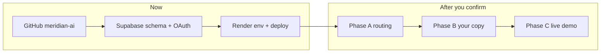

# Meridian AI — Go-Live & Launch Page Plan

**Owner:** Preston Jay Susanto · prestonjaysusanto@gmail.com  
**Repo:** [github.com/ShadowEsu/meridian-ai](https://github.com/ShadowEsu/meridian-ai)  
**Target URL:** https://meridian20.onrender.com (Render service `meridian20`)

This document is the single checklist for making the product **live** and rebuilding the **marketing launch page** with your copy and branding.

---

## 1. What you already have (branch audit)

| Asset | Location | Status |
|-------|----------|--------|
| Public GitHub repo | `ShadowEsu/meridian-ai` | Created, `main` pushed |
| Marketing launch page | `landing/index.html` + `landing/meridian-home.css` | **Built** (~870 lines HTML, Apple-style design system) |
| Product dashboard | `Meridian.html` + `src/pages/*` | **Built** (demo + live auth) |
| Supabase schema | `schema/000_init.sql` | Ready to apply |
| Deploy blueprint | `render.yaml` | Ready |
| Publish guide | `docs/WEB_PUBLISH.md` | Matches your project IDs |

### Routing today (important)

| URL | What visitors see |
|-----|-------------------|
| `/` | Dashboard SPA (`Meridian.html`) — auth or demo |
| `/home` | Marketing launch page |
| `/api/*` | Express API |

**Gap vs. original design** (`docs/LANDING_PAGE_PLAN.md`): marketing was meant to own `/`, with the app at `/app`. Cold traffic currently hits the dashboard first, not the story.

### Messaging gap

The launch page sells a **routing API** (`api.meridian.dev`, `model="auto"`). The shipped product is **cost intelligence** (dashboard, virtual keys, ingest `POST /api/v1/requests`, ML router preview). Phase 2 copy should reflect what is live today, with a “routing API” section marked *coming soon* unless you are launching the proxy endpoint at the same time.

---

## 2. Your infrastructure (reference — no secrets in git)

### Supabase — `berelpcqwplzagtktgnl`

| Field | Value |
|-------|-------|
| Region | West US (Oregon) |
| API URL | `https://berelpcqwplzagtktgnl.supabase.co` |
| REST | `https://berelpcqwplzagtktgnl.supabase.co/rest/v1/` |
| Publishable key | `sb_publishable_…` (Settings → API) |
| Secret key | `sb_secret_…` (server only — Render + local `.env`) |
| JWT signing | ECC P-256 (current key ID `e7bfaf0e-…`) — **no** `SUPABASE_JWT_SECRET` needed |
| Your auth user | `f1281d19-1805-4208-a5d2-1ac144797a0d` · Google linked |

### Google Cloud — `meridian-498300`

| Field | Value |
|-------|-------|
| Project number | `609424288083` |
| OAuth client name | Meridian |
| Client ID | `609424288083-2l51l52m5lo3evvmaiqb5imdteqbsquf.apps.googleusercontent.com` |
| OAuth callback (Supabase) | `https://berelpcqwplzagtktgnl.supabase.co/auth/v1/callback` |

### Render

- Service name: `meridian20`
- Connect repo: **`ShadowEsu/meridian-ai`** branch `main`
- Health: `GET /api/auth/config` → must return JSON with `googleEnabled`

**Checked 2026-06-02:** `https://meridian20.onrender.com/api/auth/config` returned **404** — production is not serving the API yet (wrong start command, missing env, or deploy not wired to this repo). Fix in §4 before calling the site “live.”

---

## 3. Go-live checklist (you + dashboard clicks)

Do these in order. Full links: `docs/WEB_PUBLISH.md`.

- [ ] **3.1** Supabase SQL Editor → run entire `schema/000_init.sql` → confirm 9 `meridian_%` tables
- [ ] **3.2** Google OAuth client → JavaScript origins: `http://localhost:5500`, `https://meridian20.onrender.com`
- [ ] **3.3** Google OAuth → redirect URI: only `https://berelpcqwplzagtktgnl.supabase.co/auth/v1/callback`
- [ ] **3.4** Google consent screen → **Publish app** (or add test users)
- [ ] **3.5** Supabase → Auth → Google → enable, paste Client ID + Client secret from GCP
- [ ] **3.6** Supabase → URL Configuration → Site URL `https://meridian20.onrender.com`, redirect URLs per `WEB_PUBLISH.md`
- [ ] **3.7** Local `.env` from `.env.example` → `JWT_SECRET`, `ENCRYPTION_KEY`, `MERIDIAN_STORE=supabase`, three Supabase keys → `npm run start:api` → Google sign-in works on `http://localhost:5500/?live=1`
- [ ] **3.8** Render → connect `ShadowEsu/meridian-ai` → env vars from `WEB_PUBLISH.md` → deploy → `curl` auth config returns 200
- [ ] **3.9** Smoke: open site → **Sign in with Google** → dashboard loads with your user

**Security:** Keys pasted in chat should be **rotated** in Supabase if this thread is stored anywhere public.

---

## 4. Launch page rebuild — phased plan

You said you will provide brand copy and details. Until then, use this structure. Design system: `design-system/meridian/DESIGN.md` (Action Blue `#0066cc`, SF Pro / Inter, light/dark tiles).

### Phase A — Routing & CTAs (engineering, ~1 PR)

**Goal:** First-time visitors see marketing; product lives under `/app`.

| Task | Detail |
|------|--------|
| A.1 | `server/index.with-api.js`: serve `landing/index.html` at `GET /` |
| A.2 | Serve `Meridian.html` at `GET /app` (and static assets unchanged) |
| A.3 | Update all launch CTAs: `href="/app?live=1"` (not `/`) |
| A.4 | `WEB_PUBLISH.md` + Supabase redirect URLs: add `https://meridian20.onrender.com/app**` |
| A.5 | Google OAuth origins unchanged (same host) |

**Acceptance:** `https://meridian20.onrender.com/` shows hero; **Start free** opens live auth at `/app?live=1`.

### Phase B — Copy & positioning (needs your input)

**Information to send:**

1. **One-line tagline** (replace “Pay for the prompt. Not the model.” if inaccurate)
2. **Subhead** — cost dashboard vs. routing API vs. both
3. **Founder line** — “Built by Preston Susanto” / company name (Meridian Labs vs. Meridian AI)
4. **Pricing** — keep “Free in alpha” or real tiers?
5. **Social proof** — real quote/customer or remove placeholder “Priya Nair”
6. **Savings number** — use real metric from dashboard/seed (e.g. 47%) or “illustrative”
7. **Footer legal entity** — name for © line
8. **Contact** — email, GitHub, Twitter/X, LinkedIn links

**Tasks:**

| Task | Detail |
|------|--------|
| B.1 | Replace placeholder quote + stats |
| B.2 | Align hero with **cost intelligence** (spend, budgets, agents) if API proxy is not live |
| B.3 | Developer section: document **ingest API** (`X-Meridian-Key`) instead of fictional `api.meridian.dev` unless you launch that host |
| B.4 | Add “Meridian AI” to `<title>`, nav wordmark, footer |
| B.5 | SEO: `meta description`, Open Graph, `link rel="canonical"` |

### Phase C — Interactive proof (engineering + backend)

| Task | Detail |
|------|--------|
| C.1 | **Live router demo** — small React island (or fetch-only) calling `POST /api/router/preview` (no auth) with 3 canned prompts |
| C.2 | Wire “Route prompt” hero console to real preview when API is up; fallback to current animation offline |
| C.3 | Optional: savings slider using KPI math from `server/services/budget-engine.js` |

**Acceptance:** Visitor clicks a prompt → sees real tier + model from your MLP/manual router.

### Phase D — Polish & performance

| Task | Detail |
|------|--------|
| D.1 | Lazy-load heavy scroll scenes below fold |
| D.2 | `prefers-reduced-motion` audit (partially done) |
| D.3 | Lighthouse: LCP &lt; 2s on 4G |
| D.4 | Favicon + apple-touch-icon in `landing/` |
| D.5 | Link footer Docs → GitHub README / future docs site |

### Phase E — Optional domain

| Task | Detail |
|------|--------|
| E.1 | Custom domain on Render (e.g. `app.meridian.ai` → Render, apex → landing) |
| E.2 | Update Supabase Site URL + Google origins to final domain |

---

## 5. Launch page section map (current → target)

| # | Section (today) | Keep / change |
|---|-----------------|---------------|
| 1 | Hero + animated console | **Keep** animation; update copy + CTA target `/app?live=1` |
| 2 | One endpoint / model wall | **Reframe** to “50+ models in catalog” or ingest, unless API launch |
| 3 | −47% savings | **Update** number when you provide real data |
| 4 | Cost dashboard visual | **Keep** — matches product |
| 5 | Route ledger | **Keep** — aligns with router story |
| 6 | Guardrails scroll scene | **Keep** or simplify if scope tight |
| 7 | Customer quote | **Replace** with your proof or remove |
| 8 | Developer code block | **Rewrite** for virtual-key ingest or real SDK |
| 9 | Pricing | **Your call** (alpha free vs. paid) |
| 10 | CTA band + footer | **Update** links + Meridian AI branding |

Files to edit in Phase B–D:

- `landing/index.html` — structure, copy, CTAs, meta
- `landing/meridian-home.css` — only if new sections/layouts
- `server/index.with-api.js` — routing (Phase A)
- `docs/WEB_PUBLISH.md` — redirect URL list

---

## 6. What I need from you next message

Copy-paste or answer:

1. Confirm product pitch: **“LLM cost dashboard”** vs **“routing API”** vs **both**
2. Tagline + subhead (or approve current)
3. Company name for footer/legal
4. Real savings % or “illustrative only”
5. Whether to **swap `/` and `/app` now** (recommended: yes)
6. Render: are you logged in — should deploy target stay `meridian20.onrender.com`?
7. Any screenshots/brand colors beyond Action Blue `#0066cc`

---

## 7. Suggested implementation order

1. Finish §3 go-live (backend 200 + Google login)  
2. Phase A routing PR  
3. Phase B when you send copy  
4. Phase C demo widget  
5. Phase D polish  

---

## 8. Quick links

| Task | URL |
|------|-----|
| Repo | https://github.com/ShadowEsu/meridian-ai |
| Supabase project | https://supabase.com/dashboard/project/berelpcqwplzagtktgnl |
| Supabase SQL | https://supabase.com/dashboard/project/berelpcqwplzagtktgnl/sql/new |
| Google OAuth | https://console.cloud.google.com/auth/clients?project=meridian-498300 |
| Render | https://dashboard.render.com/ |
| Publish checklist | [WEB_PUBLISH.md](./WEB_PUBLISH.md) |
| Historical landing notes | [LANDING_PAGE_PLAN.md](./LANDING_PAGE_PLAN.md) |
